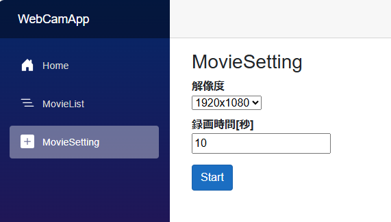
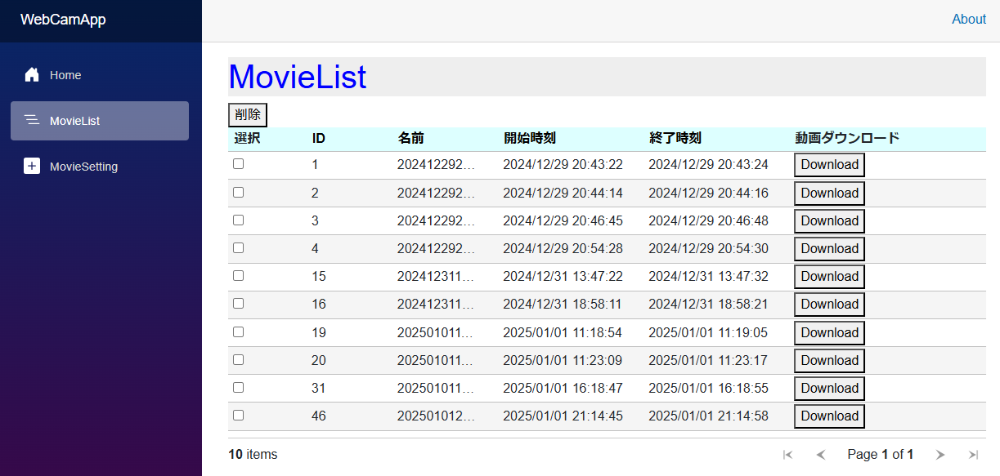
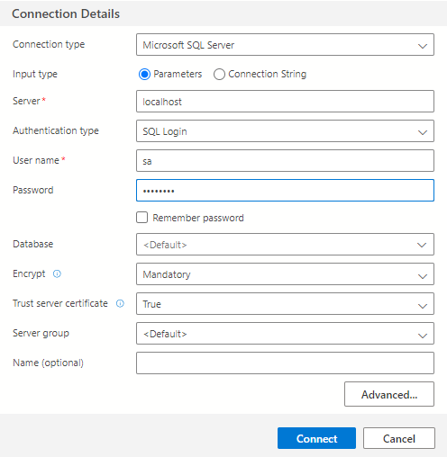
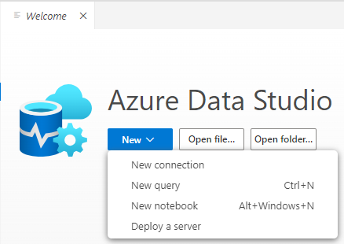
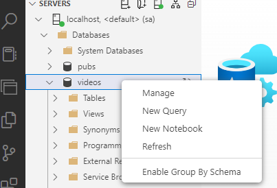

# ASP.Net Core BlazorとGstreamerによるWebアプリケーション
## コードについて
ネットワークカメラ(rtsp)からの映像をWebサーバ(Gstreamer)でmp4ファイルに変換し、データベース(SQLServer)に登録します。登録されたmp4ファイルはブラウザからダウンロードできます。


## 動作確認手順
本アプリはBlazor Server型のアプリケーションです。コードを実際に動かすためには、下記の手順を実施ください。
### Gstreamerの準備
- Gstreamerのサイト[[link]](https://gstreamer.freedesktop.org/download/#windows)
から、mingw版を選択し**Complete**でインストールしてください。
(本環境ではgstreamer-1.0-mingw-x86_64-1.24.10.msiを使用しました。)
- Windowsの"環境変数を編集"画面を開き、ユーザー環境変数の"Path"を編集します。デフォルトのインストール先の場合は下記を追加してください。
	- C:\gstreamer\1.0\mingw_x86_64\bin
	- C:\gstreamer\1.0\mingw_x86_64\lib
	- C:\gstreamer\1.0\mingw_x86_64\lib\gstreamer-1.0

※環境変数、Pathを追加した際にVisual Studioが起動していた場合は、再起動後にPathが反映されます。

### SQLServerについて
下記手順を参考に、ローカルマシンにSQLServerをインストールしました。
>参考:[1.ローカルマシンにSQL Serverを立てる](https://github.com/nakamacchi/AzRefArc.SqlDb?tab=readme-ov-file#1-%E3%83%AD%E3%83%BC%E3%82%AB%E3%83%AB%E3%83%9E%E3%82%B7%E3%83%B3%E3%81%AB-sql-server-%E3%82%92%E7%AB%8B%E3%81%A6%E3%82%8B)

- SQL Server 2022　Developer Edition[[link]](https://www.microsoft.com/ja-jp/sql-server/sql-server-downloads)をインストールください。
- インストーラ起動後は「メディアのダウンロード」を選択し、ダウンロードしたISOをマウントします。
- 管理者権限でコマンドラインを実行します**SAPWD**は適宜変更してください。
	```
	setup.exe /Q /IACCEPTSQLSERVERLICENSETERMS /ACTION="install" /FEATURES=SQL,Tools /INSTANCENAME=MSSQLSERVER /SECURITYMODE=SQL /SAPWD=“XXXXXXXX" /SQLSVCACCOUNT="NT AUTHORITY\NETWORK SERVICE" /SQLSVCSTARTUPTYPE="Automatic" /SQLSYSADMINACCOUNTS=".\Administrator"
	```

- データベースへ接続(Azure Data Studioで説明)
	- サーバ名 : localhost
	- ユーザ名 : sa
	- パスワード ： セットアップ時に指定
	- サーバ証明書を信頼する ： はい

	

- 新規データベースを作成します。"New query"を選択します。

	

- 下記SQLを貼り付けて、実行(Run)します。
	- データベース名 : videos
	```
	USE master;
	GO
	
	IF NOT EXISTS (
		  SELECT name
		  FROM sys.databases
		  WHERE name = N'videos'
		  )
	   CREATE DATABASE [videos];
	GO
	
	IF SERVERPROPERTY('ProductVersion') > '12'
	   ALTER DATABASE [videos] SET QUERY_STORE = ON;
	GO
	```
	

- videosのデータベースを左メニューから選択し、同様に"New Query"を選択します。

	

- 下記SQLを貼り付けて、実行(Run)します。
	```
	USE videos; CREATE TABLE movie (
		id INT IDENTITY(1,1) PRIMARY KEY, 
		name NVARCHAR(MAX) NOT NULL, 
		start_time DATETIME NOT NULL, 
		end_time DATETIME NOT NULL 
	);
	CREATE TABLE movie_data(
		id INT NOT NULL PRIMARY KEY,
		record_data VARBINARY(MAX)
	);
	```
	

### プロジェクトの準備
- 適当な箇所に本プロジェクトをコピーし、VisualStudio 2022で開きます。
- 下記のパッケージをNuGetで追加します。(.NetCore系は8系に合わせてください。)
	| パッケージ | バージョン |
	|:---|:---|
	| gstreamer-sharp-netcore | 0.0.8 |
	| GstSharp | 1.18.0 |
	| Microsoft.AspNetCore.Components.QuickGrid | 8.0.11 |
	| Microsoft.EntityFrameworkCore | 8.0.11 |
	| Microsoft.EntityFrameworkCore.SqlServer | 8.0.11 |

- ソリューションエクスプローラのプロジェクト名(WebCamApp)で右クリックし、「ユーザーシークレットの管理」を選択します。
	「setting.json」が作成されますので、データベースへの接続文字列を記入します。**Password**には、SQLServerのインストール時に設定したパスワードを記入してください。

	```
	{
		"ConnectionStrings": {
			"MovieDbContext": "Server=localhost;Initial Catalog=videos;Persist Security Info=False;User ID=sa;Password=XXXXXXXX;MultipleActiveResultSets=False;Encrypt=True;TrustServerCertificate=True;Connection Timeout=30;"
		}
	}
	```

### ネットワークカメラの対応について
- ネットワークカメラを使用する場合
	- rtspに対応したネットワークカメラがあると、実際の録画を再現できます。（開発環境ではTapoC310[[link]](https://www.tp-link.com/jp/smart-home/tapo/tapo-c310/)を使用しました。)
	- ネットワークカメラを使用する場合は、カメラの取扱説明書に従って「ユーザ名」「パスワード」を設定のうえ、配信URLを確認してください。
	例えば、TapoC310の場合は[[link]](https://www.tp-link.com/jp/support/faq/2680/)から、
		- 高画質ストリーム : rtsp://IP Address/stream1
		- 低画質ストリーム : rtsp://IP Address/stream2
	
		となります。(高画質、低画質は設定により異なります)

	MovieSetting.razorにユーザ名、パスワードと、URLは"rtspsrc location=~"の部分を適宜変更してください。
	```
	// カメラ用パラメータ
	// 接続するカメラに併せて変更すること
	private string CAM1IPAddr = "192.168.11.29";
	private int PortNum = 554;
	private string UserID = "tapo320";
	private string UserPW = "tapo320";
	private string Format = "H264";
	private uint FPS = 15;

	~中略~

	string cmd
		= $"rtspsrc location = rtsp://{CAM1IPAddr}:{PortNum}/{stream} ntp-sync=true latency=4000 user-id={UserID} user-pw={UserPW} ! application/x-rtp, media=video, encoding-name={Format} "
		+ "! queue2 "
		+ "! identity name=IDT "
		+ "! rtph264depay "
		+ "! h264parse "
		+ "! mpegtsmux latency=4000 "
		+ "! filesink sync=true location="
		+ SaveDir + tmpfilename;
	```
	また、VideoSettingViewModelクラスで解像度とURLを結びつけるためのDictionalyを作成しています。お使いのカメラに合わせて変更ください。
	```
	// ネットワークカメラに合わせてリストは変更すること
	public Dictionary<string, string> ResolutionList = new Dictionary<string, string>() {
		{"stream1", "1920x1080"},
		{"stream2", "640x360"},
	};
	```

- ネットワークカメラが用意できない場合
	- 下記部分を有効化することで、gstreamerのvideotestsrcの映像で実行できます。(UIからの解像度指定までは未対応です)
	```
	// 下記はvideotestsrcで試す場合
	// string cmd
	// = "videotestsrc "
	// + "! video/x-raw,width=1280,height=720,framerate=15/1 "
	// + "! qsvh264enc "
	// + "! h264parse "
	// + "! identity name=IDT "
	// + "! mpegtsmux "
	// + "! filesink location="
	// + SaveDir + tmpfilename;
	```